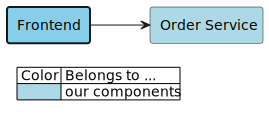
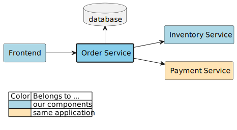
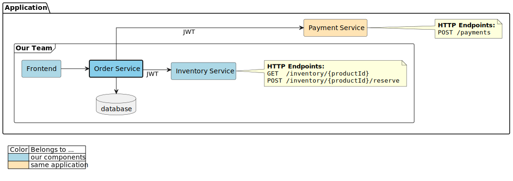
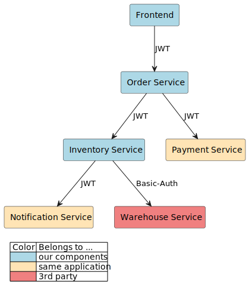

= Documentation Repository

This is the repository where the architecture documentation is collected and assets are generated.

== How Does It Work?

This repository has a GitHub Action workflow that reacts to any changes in the `.build` folder on the `master` branch.

The sources of all generated content are located under the `.build/src/**` folder:

* `.build/src/json/components` contains `.json` description files for all components of the documented system
* `.build/src/plantuml` contains hand-crafted diagrams

If any of the source input files or build script parts are changed, all images and documents are re-generated.
Any generated file that differs from its previous version is committed and pushed to the `master` branch.
This means documentation files are always up-to-date.

=== Automatic Updates

Automatically generating diagrams is nice and all, but the real interesting part is how the `.json` application descriptions are updated.

.Example: 'backend-service-1' is changed
[.text-center]
image:diagrams/extra/update-process.svg[]

Each application is responsible for generating and updating its own `.json` file.
Generally this is done by having the relevant information (e.g. dependents, dependencies, etc.) collected during the application's `master` build and generating the `.json` file.
If the overall application build (incl. tests) was successful, the `.json` file is automatically committed and pushed to this repository.

Since this commit will constitute a relevant change to the `.build` folder, the generation workflow will be executed, updating all affected images, documents, etc.

== Document Types

=== Events Overview

This document lists all known events that are emitted by any of "our" applications.

Take a look link:documents/events.adoc[here].

=== Used Endpoints Overview

This document lists all known components who have documented endpoints used by any of "our" applications.
For each component, the used endpoints and who is using them are listed.

Take a look link:documents/endpoint.adoc[here].

== Diagram Types

=== "Application Context" Diagram

An "application context" diagram is focused on a specific application and shows that application's dependents and dependencies.
Dependents are other components of the overall system that are dependent on the focus application (e.g. using its API).
Dependencies are any components that are used by the focus application, like databases or other applications.

==== "Simple" Variants

The "simple" variant just renders _all_ components and their relationships.
It does not include any boundaries or additional data.

.frontend

.order-service

.inventory-service

==== "HTTP" Variants

The "http" variant renders all available data related to HTTP communication.
In this example, this includes the list of all HTTP endpoints used of a dependency.
Dependents and dependencies are limited to _backends_ and _frontends_.

.frontend
image:diagrams/components/http_poly/frontend.svg[]

.order-service
image:diagrams/components/http_poly/order-service.svg[]

.inventory-service

==== "Full" Variants

The "full" variant renders _all available data_, including grouping all components by their `system` and `group` properties.

.frontend
image:diagrams/components/full_orthogonal/frontend.svg[]

.order-service

.inventory-service
image:diagrams/components/full_orthogonal/inventory-service.svg[]

=== "Applications Overview" Diagram

An "applications overview" diagram combines the information of all applications into a single diagram.
This gives us an overview of our whole system with all communication paths / dependencies.

.top-to-bottom

.left-to-right
image:diagrams/overview/left-to-right_poly/overview.svg[]
