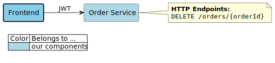
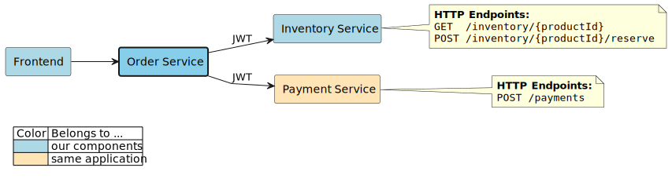
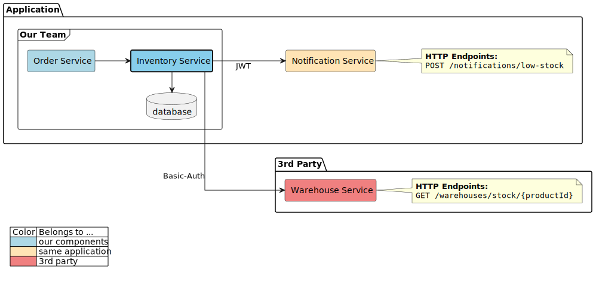
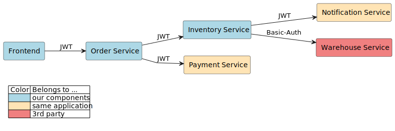

= Documentation Repository

This is the repository where the architecture documentation is collected and assets are generated.

== How Does It Work?

This repository has a GitHub Action workflow that reacts to any changes in the `.build` folder on the `master` branch.

The sources of all generated content are located under the `.build/src/**` folder:

* `.build/src/json/components` contains `.json` description files for all components of the documented system
* `.build/src/plantuml` contains hand-crafted diagrams

If any of the source input files or build script parts are changed, all images and documents are re-generated.
Any generated file that differs from its previous version is committed and pushed to the `master` branch.
This means documentation files are always up-to-date.

=== Automatic Updates

Automatically generating diagrams is nice and all, but the real interesting part is how the `.json` component descriptions are updated.

.Example: 'backend-service-1' is changed
[.text-center]

Each component generates the parts of its overall description during its `master` build and uploading it with a specific artifact name.
The combining of those files into the actual component description however is done using a link:.github/actions/update-component/action.yml[GitHub action] provided by this repository.
That actions downloads that artifact, checks out this repository and executes a Gradle task that combines the different parts into a single file.
If this file is different from its current version it is committed.

Since such a commit will constitute a relevant change to the `.build` folder, the generation workflow will be executed, updating all affected images, documents, etc.

== Document Types

=== Events Overview

This document lists all known events that are emitted by any of our application's components.

Take a look link:documents/events.adoc[here].

=== Endpoints Overview

This document lists all known components who have documented endpoints used by any of our components.
For each of them, the used endpoints and who is using them are listed.

Take a look link:documents/endpoints.adoc[here].

== Diagram Types

=== "Component Context" Diagram

A "component context" diagram is focused on a specific component and shows that component's dependents and dependencies.
Dependents are other components of the overall system that are dependent on the focus component (e.g. using its API).
Dependencies are any components that are used by the focus component, like databases or other components.

==== "Simple" Variants

The "simple" variant just renders _all_ components and their relationships.
It does not include any boundaries or additional data.

.frontend
image:diagrams/components/simple_default/frontend.svg[]

.order-service
image:diagrams/components/simple_default/order-service.svg[]

.inventory-service
image:diagrams/components/simple_default/inventory-service.svg[]

==== "HTTP" Variants

The "http" variant renders all available data related to HTTP communication.
In this example, this includes the list of all HTTP endpoints used of a dependency.
Dependents and dependencies are limited to _backends_ and _frontends_.

.frontend

.order-service

.inventory-service
image:diagrams/components/http_poly/inventory-service.svg[]

==== "Full" Variants

The "full" variant renders _all available data_, including grouping all components by their `system` and `group` properties.

.frontend

.order-service
image:diagrams/components/full_orthogonal/order-service.svg[]

.inventory-service

=== "Applications Overview" Diagram

An "application overview" diagram combines the information of all components into a single diagram.
This gives us an overview of our whole application with all communication paths / dependencies.

.top-to-bottom
image:diagrams/overview/top-to-bottom_poly/overview.svg[]

.left-to-right

=== "Messaging" Diagram

A "messaging" diagram combines the messaging related information of all components into a single diagram.
This gives us an overview of our asynchronous communication infrastructure.

